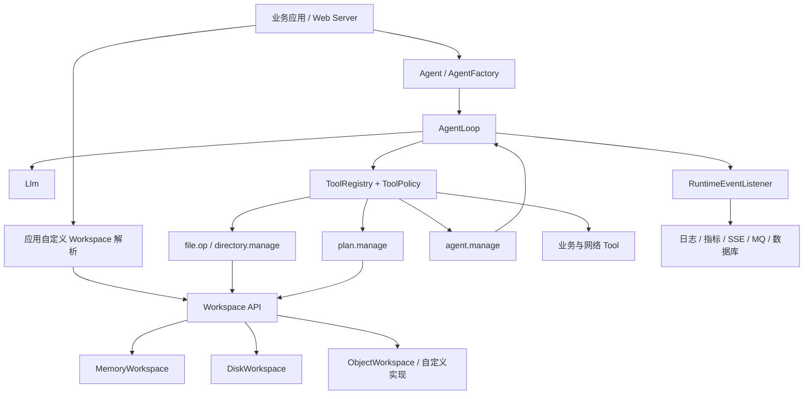

# Agent Virtual Runtime 全局架构

本文从框架维护者和接入者视角说明 AVR 解决什么问题、各模块如何协作，以及哪些职责仍属于宿主应用。具体代码和配置请继续阅读 [接入指南](INTEGRATION.md)，可直接运行的产品化示例见 [avr-examples](avr-examples/README.md)。

## 1. AVR 是什么

AVR 是面向 Java 11+ 中心化 AI Agent 的轻量运行时。它把模型熟悉的“本地工作目录”抽象为可替换的虚拟 Workspace，并在同一套 Runtime 中提供 Agent Loop、Function Call、计划校验、多 Agent、Skill、Artifact 和运行事件。

AVR 的核心目标是让一个长期运行的 Java Web 服务能够为不同请求装配不同 Workspace，而不必为每次任务启动虚拟机、容器或宿主机 Shell。接入方可以把 Workspace 映射到内存、挂载磁盘、对象存储或公司内部存储系统，也可以自行决定业务、租户、用户、任务和目录之间的关系。

AVR 不是内核沙箱，不负责执行任意二进制程序，也不替代应用的认证、授权、配额、密钥管理和网络边界。外部系统应通过参数明确、可审计、可授权的 Tool 接入。

## 2. 总体结构

一次运行的基本链路如下：

1. 宿主应用根据当前请求选择 Workspace、身份上下文、Skill、模型和运行选项；
2. `AgentLoop` 将对话历史、Skill 和当前可用 Tool 发送给模型；
3. 模型返回一个或多个原生 Function Call；
4. Runtime 经过 `ToolPolicy` 授权后，并发执行只读 Tool，并为写操作设置串行屏障；
5. Tool Result 按原始调用顺序回填模型上下文，Loop 继续运行；
6. 开启计划模式时，最终回答只有在计划步骤经过真实工具证据和 Workspace 条件校验后才会被接受；
7. 全过程通过 `RuntimeEventListener` 输出模型、思考、Tool、计划和终态事件。

## 3. 能力分层

| 层 | 核心职责 | 主要类型 |
| --- | --- | --- |
| API | 稳定公共契约，不绑定模型和存储厂商 | `Agent`、`AgentRequest`、`Llm`、`Tool`、`Workspace` |
| Runtime | ReAct/Tool Loop、并发与屏障、超时、重试、无进展检测、计划完成约束 | `AgentLoop`、`AgentLoopOptions` |
| Workspace | 虚拟路径、目录和长文本操作、Artifact 快照 | `Workspace`、`MemoryWorkspace`、`DiskWorkspace`、`ObjectWorkspace` |
| Tool | 将 Workspace、计划、子 Agent、搜索和业务 API 暴露为 Function Call | `FileOpTool`、`DirectoryTool`、`PlanTool`、`AgentManageTool` |
| Model | OpenAI Chat Completions 兼容协议、SSE、Function Call 拼接 | `OpenAiLlm`、`OpenAiConfig` |
| Spring | YAML 绑定、Bean 自动装配和扩展点发现 | `AvrAutoConfiguration`、`AgentFactory` |
| Example | 可部署工作台、Chat/SSE、文件树、预览、模型选择和多轮会话 | `avr-examples` |

## 4. Workspace 是核心边界

模型只看到 `/workspace/report/index.html` 这样的虚拟路径，不知道真实磁盘目录、对象 Key 或用户身份。框架提供统一的文件、目录、范围读取、检索、追加、插入、替换和删除语义：

- `MemoryWorkspace`：跟随 Java 对象生命周期，适合短任务和测试；
- `DiskWorkspace`：文件与 Artifact 元数据持久化到指定根目录；
- `ObjectWorkspace`：通过轻量 `ObjectStore` 适配对象存储；
- 自定义 `Workspace`：对接公司的文档、网盘、数据库或统一存储组件。

AVR 不规定 Workspace ID 的命名方式。应用可以使用任务 ID、随机 ID、哈希值，或将业务、业务线、用户等信息映射到自身的存储前缀。`/.avr` 是内部元数据命名空间，不应暴露给模型。

## 5. Tool 与可信完成

标准 Tool 按领域收敛，而不是为每个动作创建一个 Java 类：

- `file.op`：文件生命周期和内容编辑；
- `directory.manage`：目录生命周期；
- `artifact.commit`：提交带入口文件的不可变快照；
- `plan.manage`：创建、修订、更新和检查执行计划；
- `agent.manage`：创建、执行、查询和取消子 Agent 任务；
- `web.search`、`http.get`：需要应用显式提供实现或受控客户端的网络能力。

Prompt 只能指导模型，不能证明任务完成。计划模式会将“完成”绑定到本轮成功 Tool 调用，并可进一步校验 `verifyPath`、`verifyDirectory`、`minBytes` 和 `absentPath`。更复杂的业务真实性要求应由应用通过 `completionCheck` 或自定义 Tool 校验。

## 6. 框架与宿主应用的职责

| AVR 提供 | 宿主应用负责 |
| --- | --- |
| Agent Loop、Tool 调度、超时和运行事件 | HTTP/WebSocket 接口、认证和限流 |
| Workspace 抽象和内置存储实现 | Workspace 与业务身份的映射、租户隔离和配额 |
| 标准文件、目录、计划和 Artifact Tool | 数据库、搜索、Git、内部 API 等业务 Tool |
| OpenAI 兼容模型客户端 | 模型账号、API Key、路由和成本策略 |
| ToolPolicy 扩展点 | 实际授权规则、审计和敏感数据治理 |
| 可观察事件协议 | 事件持久化、跨节点聚合和前端传输 |

这种边界让 AVR 可以嵌入现有 Tomcat/Spring Boot 服务，也可以作为普通 Java 库使用，而不会强迫接入方采用独立 Server、固定用户模型或固定目录结构。

## 7. 扩展点

- 实现 `Llm` 接入其他模型协议；
- 实现 `Workspace` 或 `ObjectStore` 接入内部存储；
- 实现 `Tool` 暴露业务能力，并使用 JSON Schema 约束参数；
- 实现 `ToolPolicy` 执行请求级授权；
- 注册 `Skill` 提供领域知识与操作规范；
- 实现 `RuntimeEventListener` 对接日志、指标、OpenTelemetry、数据库、MQ、SSE 或 WebSocket；
- 使用 `AgentTaskManager` 注册由应用定义的专业 Agent Runtime。

## 8. 推荐接入路径

1. Spring Boot 项目优先引入 `avr-spring-boot-starter`，通过 YAML 配置模型和默认 Agent；
2. 为每个业务请求解析正确的 Workspace，并通过 `AgentFactory` 创建 Agent；
3. 注册业务 Skill、ToolPolicy、搜索/网络 Tool 和运行事件监听器；
4. 对会修改 Workspace 的任务开启计划模式，并配置业务完成校验；
5. 需要 UI 时参考 `avr-examples` 的 SSE、会话恢复、文件树、Artifact 预览和 Tool 展示协议；
6. 上线前落实密钥托管、存储隔离、超时、配额、日志脱敏和故障恢复。

完整 Maven、Spring、非 Spring 和扩展代码请参阅 [INTEGRATION.md](INTEGRATION.md)。
